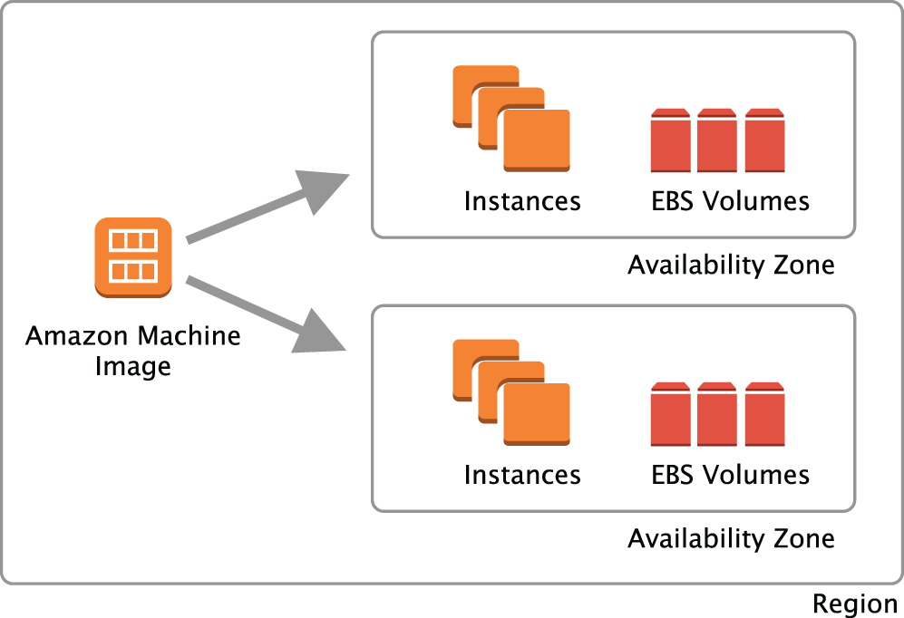

# Introduction to Compute and Networking

THE AWS CERTIFIED DEVELOPER – ASSOCIATE EXAM TOPICS COVERED IN THIS CHAPTER MAY INCLUDE, BUT ARE NOT LIMITED TO, THE FOLLOWING:

-    Domain 1: Development with AWS Services
        Task Statement 1: Develop code for applications hosted on AWS
-     Domain 2: Security
        Task Statement 1: Implement authentication and/or authorization for applications and AWS services
-    Domain 4: Troubleshooting and Optimization
        Task Statement 3: Optimize applications by using AWS services and features

Now that you have an AWS account and you can make API calls from your local machine, it is time to explore how to run code on the AWS Cloud. AWS provides a broad set of compute options through the following services:

-   Amazon Elastic Compute Cloud (Amazon EC2)
-   Amazon Lightsail
-   AWS Elastic Beanstalk
-   Amazon Elastic Container Service (Amazon ECS)
-   Amazon Elastic Container Service for Kubernetes (Amazon EKS)
-   AWS Lambda
-   VMWare Cloud
-   Amazon app runner

In this chapter, you will explore Amazon Elastic Compute Cloud (Amazon EC2), which allows you to launch virtual machines called instances. You will learn about the components of an EC2 instance and explore an example of customizing an instance to run an application. Then, to learn how to customize the network environment for your instances, you will explore the network controls of Amazon Virtual Private Cloud (VPC). Finally, you will review some of the concerns related to managing your compute and networking environments.

Amazon EC2 and Amazon VPC are foundational services, and many of the concepts introduced in this chapter are transferrable to working with other AWS services.

## Amazon Elastic Compute Cloud

Amazon Elastic Compute Cloud (EC2) enables you to provision computing environments called instances. With Amazon EC2, you have the flexibility to choose the hardware resources you need. You are in control of the operating system and any other software that will run on the instance.

An Amazon EC2 instance is a virtual machine that runs on a host machine within a specific AWS availability zone. This virtualization means that your instance may end up sharing the same physical hardware as that of another AWS customer, but AWS’s multitenant architecture ensures that each instance is fully isolated from another.

In addition to virtualized environments, some EC2 instance types offer bare-metal access. Bare-metal instances provide your applications with direct access to the processor and memory resources of the underlying server.
Instance Types

With EC2, you choose your hardware resources from a broad set of preconfigured options by selecting a specific instance type and instance size. For example, an instance will have a certain number of virtual CPUs (vCPUs) and a specific amount of RAM. Instance types are rated for a certain level of network throughput. Some instance types also include other hardware resources such as high-performance local disks, graphics cards, or chips optimized for machine learning.

Even though AWS presets the hardware allocation for an instance type, a wide variety of instance types and sizes are available so that you can select the right level of resources for your application. For example, a t2.nano instance type allocates a fraction of a virtual CPU and 0.5 GiB of RAM to your instance. On the other end of the size spectrum, an x1e.32xlarge instance type provides 128 virtual CPUs and 3,904 GiB of RAM.

Instance types are also grouped into instance families to help you choose the appropriate instance for your application. Instances within a given family share similar characteristics, such as the ratio of vCPU to RAM or access to different types of storage options.

For an overview of the different instance families and their use cases, see Table 2.1.

TABLE 2.1 Amazon EC2 instance families
Amazon EC2 instance family	For applications that require …
General purpose	A balanced mix of CPU, RAM, and other resources
Compute optimized	A high amount of CPU, such as high-performance web servers, scientific modeling, and video encoding
Memory optimized	A large amount of RAM, such as in-memory databases and distributed web scale in-memory caches
Storage optimized	A large amount of storage and input/output (I/O) throughput, such as data warehousing, analytics, and big data distributed computing
HPC Optimized	A variety of configurations aimed at specific high-performance computing workloads
Accelerated computing	Dedicated graphics processing unit (GPU) or field-programmable gate array (FPGA) resources, such as 3D rendering, deep learning, genomics research, and real-time video processing

Because EC2 instances are resizable, you need not worry about how to correctly provision your instance the first time, or whether your choice will be sufficient for your future needs. All you need to do to change your hardware configuration is stop the instance, modify the instance type attribute, and then start the instance again.
Storage

Your instance requires storage volumes for both the root volume and any additional storage volumes that you want to configure. You can create persistent storage volumes with Amazon Elastic Block Store (Amazon EBS) to provide block storage devices for Amazon EC2 instances. Certain instance types enable you to mount volumes based on an instance store, which is temporary storage local to the host machine.

For an overview of the relationship between Amazon EBS volumes, instance store volumes, and the Amazon EC2 instance, see Figure 2.1.
A diagram depicting an Amazon EC2 instance connected to Amazon EBS volumes. It shows a host computer with an instance store and the root volume labeled as vol-xxxxx.

FIGURE 2.1 Amazon EC2 storage

### Persistent Storage

For EC2 instances, AWS provides persistent block storage via Elastic Block Store (EBS). EBS volumes can be formatted with a filesystem and mounted by your instance. You attach an EBS volume to a single instance at a time, but you may detach and reattach to instances at your discretion.

EBS volumes exist outside of EC2 and have their own life cycle; they are also replicated within an AZ for high durability and can be backed up on a schedule. Certain EC2 instance types are designated “EBS-optimized,” meaning that they are tuned with enhanced network capabilities to achieve low latency when using EBS.

EBS is a highly versatile storage service that is explored in more detail in Chapter 3, “AWS Data Storage.”
Temporary Storage

Certain Amazon EC2 instance types also allow you to mount instance store volumes—storage local to the physical host that runs your Amazon EC2 instance. This ephemeral storage disappears whenever the instance is stopped, so while its low latency can be effective for transient use cases like caching, it should not be used for any data that needs to persist.

This storage can have a high read/write performance because it is physically attached to the host machine that runs the instance. However, because this storage is local to the host machine, your data persists only while the instance is running on that host machine.

EC2 instance store is also examined in more detail in Chapter 3.
### Software Images

When an EC2 instance first boots, it requires an operating system (OS) and the configuration of attached storage volumes. An Amazon Machine Image (AMI) provides the template for the OS and applications on the root volume of your instance. AMIs also provide a block device mapping that can specify additional volumes to mount when an instance launches, as shown in Figure 2.2.
A diagram illustrating an amazon machine image (AMI) distributing instances and EBS volumes across two availability zones within a region. Arrows indicate the connection between the AMI and the resources in each zone.



AWS provides a variety of AMIs on different operating systems, some preconfigured with popular software packages. Third parties may also make AMIs available with their own software through the AWS Marketplace. Some third-party AMIs have a cost associated with them.

You can create your own AMIs from an instance that you have previously customized, which is a great way to accelerate boot time for workloads that require specific software configuration. This is a common tactic for use with AWS Auto Scaling groups, where you may need new instances to come online very quickly in response to user demand. AMIs are region-specific but can be shared across regions or even accounts. To control which AWS accounts can use your AMIs, define the launch permissions for your AMI.

In some cases, the cost of software licensing may be included in the hourly rate of the instance in addition to EC2 on-demand runtime costs. Windows Server is one example of an AMI that incorporates software costs into the EC2 costs.
Network Interfaces

Virtual network interfaces called elastic network interfaces (ENIs) provide networking for your EC2 instances. Each instance is assigned a primary network interface associated with a subnet of a VPC and receives a private IP address to communicate with other resources.

To give your instance a public IP, you may allocate an Elastic IP to associate with the machine. Elastic IPs may be detached from one instance and attached to another at any time. While IPv4 addresses have a small monthly cost, IPv6 addresses are free. Keep in mind that merely having a public IP does not make your instance publicly accessible; clients or users still need a path to the machine. This can be achieved, among other ways, by placing the instance in a public subnet, or routing traffic to it with a public load balancer. In addition, the instance’s security groups must allow traffic to reach the instance.

Security groups protect traffic entering and exiting an instance’s network interface. Security groups act as a stateful firewall. To make network connections to your instance, you must set security group rules to allow the connection.

You can attach additional network interfaces to an EC2 instance, each with its own MAC addresses and IP address associations. Unlike the primary ENI, you can detach a secondary network interface from one instance and later attach it to another.
Accessing Instances

By default, Linux Amazon EC2 instances provide remote access through Secure Shell (SSH), and Windows Amazon EC2 instances provide remote access through the Remote Desktop Protocol (RDP). To connect to these services, you must have the appropriate inbound rules on the security group for the instance.
Default User

The default user for Amazon Linux instances is ec2-user. For other Linux operating systems, this default user may vary depending on the AMI provider. For example, the default user for Ubuntu Linux is ubuntu.

For Windows instances, the default user is Administrator. This account may have a different name depending on the language of the server. For example, if the server is configured with French as the language, the administrator account is localized to Administrateur.
Amazon EC2 Key Pairs

In order to connect to an instance via SSH, you must configure SSH key access with a user on the server. AWS allows you to do this at instance creation time by associating an EC2 key pair with the default login user.

An EC2 key pair consists of two files: a public key and a private key. When you launch an instance, you may choose to either create a new key pair or use an existing one already on your account to configure SSH access. AWS will associate the public key with the default login user, after which you may use the private key to SSH as that user. When creating a new key pair, AWS allows you to download the private key only once. Treat the private key like a password and keep it secure!

To use SSH to connect to an Amazon Linux instance with your private key, perform the following from a Mac or Linux-based system:

chmod 400 /path/to/key

ssh -i /path/to/key ec2-user@<your instance IP>

If you do not specify a key pair when you launch the instance, you will be unable to connect via SSH to that instance, unless you use another method to sign in and configure SSH.
Session Manager

Session Manager is a feature of the AWS Systems Manager service that provides a secure browser-based interface to your instances, allowing you to log in without needing to maintain SSH keys or even open inbound ports. By attaching an IAM role with the AmazonSSMManagedInstanceCore policy to your instance and making sure the Session Manager agent is running (a default installation on Amazon Linux), you can enable Session Manager and get a shell right in your browser. This tool is particularly useful for instances without public IP addresses or in private subnets, as you can avoid the need to expose the server or create other “jumpbox” instances to reach it.
EC2 Instance Connect

Amazon EC2 Instance Connect provides a secure way to connect to your EC2 instances using SSH. It simplifies key management by allowing you to push a temporary SSH public key to the instance’s metadata and connect without needing to manage permanent keys. This is especially useful for providing time-bound, auditable access. As with Session Manager, Instance Connect functionality is enabled by attaching the appropriate IAM role to your instance via its instance profile.
Instance Life Cycle

An Amazon EC2 instance has three primary states: running, stopped, and terminated. Additionally, there are intermediate states of pending, stopping, and shutting down. On-demand Amazon EC2 instances accrue charges for the compute resources only when they are in the running state. However, EBS volumes persist data even when an instance is stopped, so the charges for persistent storage from any EBS volumes accrue independent of the state of the instance.

When you first launch an instance from an AMI, it goes into the pending state until it enters the running state on a host machine.

After an instance is running, for instances with EBS-backed storage, you can stop the instance. If you stop the instance, it enters the stopping state. If the host has an instance store drive, any data residing on that drive will be erased.

When an instance is stopped, you can modify attributes, such as instance type, that cannot be changed while the instance is running. You can also start stopped instances. When you start an instance, it enters the pending state until it is running again.

Typically, each time an instance is started, it is launched on a different physical host machine than before. If the underlying physical host is impaired and requires maintenance, stopping and then starting the EC2 instance moves the instance to a healthy host. This is your first, best troubleshooting move if you find an EC2 instance suddenly unresponsive and unreachable. Keep in mind that a simple reboot will not achieve the same goal.

You can also terminate an instance. It first enters the shutting down state; then eventually it is terminated. The default behavior is to delete the EBS volumes associated with the instance on termination, although this can be configured differently.

To view the life cycle of an Amazon EC2 instance, see Figure 2.3.
A flowchart depicting the lifecycle of an amazon EC2 instance. Shows states like pending, running, stopping, and terminated, with transitions for actions like launch, stop, and reboot.

FIGURE 2.3 Amazon EC2 instance life cycle
Running Applications on Instances

This section explores some features of EC2 that are useful when you run applications or custom-code on an instance. These include ways of customizing the software on an instance and discovering properties about the instance. An example that ties these features together is provided. Finally, we discuss how you can monitor the status of the instance.
Connecting to Amazon EC2 Instances

With EC2 instances, you have full administrative control to install software packages on your instance and create additional user accounts as needed. As mentioned earlier, you can directly connect to Linux instances via SSH using the private key from the Amazon EC2 key pair, as shown in Figure 2.4.
A terminal window displaying a successful SSH connection to an Amazon Linux 2023 EC2 instance. The command prompt shows the last login information and the user’s IP address.

FIGURE 2.4 Using SSH with an Amazon EC2 instance

For a Windows instance, the password for the Administrator account is encrypted with the public key. You can decrypt the password by using the associated private key, as illustrated in Figure 2.5 and Figure 2.6.

After you have decrypted the password, you can use Microsoft Remote Desktop to connect to the instance.
Customizing Software with User Data

You can connect to your instance and install any applications you want from an interactive session. However, one of the advantages of moving to the cloud is to automate previously manual steps. Instead of logging in to the instance, another way to customize the software on your instance is to provide user data as part of the request to launch the instance. For Linux instances, user data can be a shell script or a cloud-init directive. On Windows instances (depending on the version of Windows Server), either EC2Config or EC2Launch will process the user data. By default, commands supplied to user data execute only at first boot of the instance.

Here is an example of installing an Apache web server on an Amazon Linux 2 instance with a shell script that is provided as the user data:

#!/bin/bash

yum update -y

yum install httpd -y

systemctl start httpd

systemctl enable httpd

A screenshot of the get windows password page. Shows fields to upload or paste a private key file to decrypt the initial Windows administrator password for an instance.

FIGURE 2.5 Decrypting a Windows password
Discovering Instance Metadata

With the instance metadata service (IMDS), code running on an Amazon EC2 instance can discover properties about that instance. The IMDS exposes a special IP address, 169.254.169.254, which you can query using HTTP to perform lookups. By first asking the metadata service for a token, then using that token to inquire about the environment, you can query a broad range of metadata attributes, as shown in Figure 2.7. These attributes can include the instance ID, AMI ID, hostname, and much more.

With IMDS, it also possible to retrieve the user data that was used to bootstrap an instance, as shown in Figure 2.8.


Anyone who can access an instance can view its metadata and user data. Do not store sensitive data, such as passwords or access keys, in user data.
A screenshot of the AWS EC2 console showing RDP client connection details. It includes the instance ID, private IP, username, and password for accessing a windows instance via remote desktop.

FIGURE 2.6 Viewing a Windows password
Obtaining AWS Credentials

Usually, when interacting with AWS services via the CLI or various programming language SDKs like boto, you must either explicitly provide AWS credentials in the form of an access key ID and secret access key, or ensure that those values are set in environment variables. However, when calling from an EC2 instance, it is possible to connect to AWS services without any keys at all, using the instance’s associated IAM instance profile.

Instance profiles are how you assign an IAM role (with its associated policies) to an instance. When you see “instance profile” as a configurable field on EC2 instances in the console or other parts of AWS, you can think “attached IAM role.” A role can be used on many instances at once, but an instance can only have one role at a time. To update the permissions on an instance, you can either update the policies attached to its role or swap the attached role at any time.
A terminal window showing commands to retrieve EC2 instance metadata. The first command generates a token, and the second command lists metadata categories such as ami-id, hostname, and instance-id.

FIGURE 2.7 Amazon EC2 metadata attributes
A Terminal window displaying a series of commands executed on an EC2 instance. It shows the installation and enabling of the HTTPD service along with a command to retrieve the AWS metadata token.

FIGURE 2.8 Querying Amazon EC2 user data

When an IAM role is associated with an instance, the EC2 service makes the necessary calls to the Security Token Service automatically to generate short-term credentials for that instance that confer all the capabilities of the attached IAM role. The credentials are exposed to the instance through the Amazon EC2 metadata service, as shown in Figure 2.9.
A diagram showing the process of an EC2 instance pulling temporary credentials via the metadata service. The EC2 service periodically refreshes role credentials with the security token service (STS).

FIGURE 2.9 Instance profile and IAM role credentials
Serving a Custom Web Page

Let’s bring this all together in a short demo. This example combines EC2 user data, the EC2 metadata service, and IAM roles to configure an instance with a static web page that shows (and tells!) information about the host.

Entering the following script as the user data of a new Amazon Linux instance generates a static page that displays the instance ID, instance type, availability zone, and public IP address of the instance at the time the script was executed.

The first line of the script declares the type of script. Then the script installs the Apache web server and configures it to run as a service. Because user data runs as root, there is no need to use the sudo command.

Next, the script makes several calls to the Amazon EC2 metadata service and saves the results into environment variables to be used later in the script.

To show how instance profiles confer privileges to the instance that can be used by the CLI, the script makes a call to Amazon Polly to generate an mp3. For this API call to succeed, you must assign the instance an IAM role that allows permissions to the Amazon Polly SynthesizeSpeech action, such as the managed AmazonPollyReadOnlyAccess policy.

Using all these values, the script generates a static HTML page for Apache to serve on port 80. After this script completes, your EC2 instance can respond to HTTP requests and show the customized page. To see this page, you must verify that the EC2 instance has port 80 open in its security group and is assigned a public IP address.

```bash
#!/bin/bash

# Install Apache Web Server 
yum update -y
yum install httpd -y
systemctl start httpd
systemctl enable httpd
# Request and store a session token for the metadata service
TOKEN=`curl -X PUT "http://169.254.169.254/latest/api/token" -H "X-aws-ec2-metadata-token-ttl-seconds: 21600"`
# Use the token to retrieve instance metadata
ID=$(curl -H "X-aws-ec2-metadata-token: $TOKEN" \
http://169.254.169.254/latest/meta-data/instance-id)

TYPE=$(curl -H "X-aws-ec2-metadata-token: $TOKEN" \
http://169.254.169.254/latest/meta-data/instance-type)

AZ=$(curl -H "X-aws-ec2-metadata-token: $TOKEN" \
http://169.254.169.254/latest/meta-data/placement/availability-zone)

IPV4=$(curl -f -H "X-aws-ec2-metadata-token: $TOKEN" \
http://169.254.169.254/latest/meta-data/public-ipv4)

 
# Set up the Web Site

cd /var/www/html

 

## Make AWS Cloud API calls to generate an audio file

VOICE="Matthew"

aws polly synthesize-speech --region us-west-2 --voice-id $VOICE --text "Hello from EC2 instance $ID." --output-format mp3 --engine neural instance.mp3

 

## Generate customized index.html for this instance

echo "<html><body><H1>Welcome to your EC2 Instance</H1><p><p>"> ./index.html

echo "<audio controls>">> ./index.html

echo '<source src="instance.mp3" type="audio/mp3">'>> ./index.html

echo 'Here is an <a href="instance.mp3"> audio greeting.</a> '>> ./index.html

echo "</audio><p><p>">> ./index.html

echo "There are many other instances, but">> ./index.html

echo "<strong>$ID</strong> is yours.<p><p>">> ./index.html

echo "This is a <strong>$TYPE</strong> instance">> ./index.html

echo " in <strong>$AZ</strong>. <p><p>">> ./index.html

echo "The public IP is <strong>$IPV4</strong>.<p><p>">> ./index.html

echo "</body></html>">> ./index.html

Monitoring Instances

Now that you have an application running on your instance, you may be interested in understanding how that application performs, watching its resource usage, and ensuring that it stays up and running.

For each of your instances, the EC2 service automatically collects metrics related to CPU utilization, disk reads and writes, network utilization, and instance reachability, and makes them available in Amazon CloudWatch. You can supplement these built-in metrics with data from the guest operating system on your instance, such as memory utilization and logs from your application, by installing and configuring the Amazon CloudWatch agent on the instance.

Using Amazon CloudWatch, you can automate actions based on a metric through Amazon CloudWatch alarms. For example, you can configure an Amazon CloudWatch alarm that applies the “recover instance” action if status checks show that the host running the instance is impaired.
Customizing the Network

The out-of-the-box Amazon VPC service offers a straightforward path to launch EC2 instances, but grasping the details of how VPCs work to create software-defined networks is crucial. This section delves into the functionality of VPCs, which lets you establish virtual networks in an AWS region tailored to your computing needs.
Amazon Virtual Private Cloud

Amazon Virtual Private Cloud (VPC) provides logically isolated networks within your AWS account. Although advanced AWS users often adopt multi-VPC architectures, for many users, it’s not inaccurate to call a VPC “your data center in the cloud” and think of it as the network container for all your AWS resources. VPC networks can span all the availability zones within a specific AWS region. For each VPC, you have full control over whether the VPC is connected to the Internet, to private on-premises networks, or to other Amazon VPCs. Until you explicitly create these connections, instances in your VPC are able to communicate with other instances in the same VPC.

You define an Amazon VPC with one or more blocks of addresses specified in the Classless Inter-Domain Routing (CIDR) notation. If, for example, you specified 10.0.0.0/16 as the block for a VPC, this means that the VPC includes IP addresses in the range from 10.0.0.0 through 10.0.255.255. For an example of an Amazon VPC spanning multiple availability zones in a region, see Figure 2.10.
Connecting to Other Networks

By default, an Amazon VPC is an isolated network. Instances within an Amazon VPC cannot communicate with the Internet or other networks until you explicitly create connections. Table 2.2 provides an overview of various types of connections that you can establish be-tween an Amazon VPC and other networks.

TABLE 2.2 Amazon VPC connection types
Connection type	Description
Internet Gateway	A highly available connection that allows outbound and inbound requests to the internet from your Amazon VPC
Egress Only Internet Gateway	A special type of internet gateway for IPv6 that allows outbound traffic and corresponding responses but blocks inbound connections
Virtual Private Gateway	Allows you to establish a private connection to your corporate network by using a VPN connection or through Direct Connect (DX)
Amazon VPC Endpoints	Allows traffic from your Amazon VPC to go to specific AWS services or third-party SaaS services without traversing an Internet gateway
Amazon VPC Peering	Privately routes traffic from one Amazon VPC to another Amazon VPC by establishing a peer relationship between this VPC and another VPC
AWS Transit Gateway	Allows you to centrally manage connectivity between many VPCs and an on-premises environment using a single gateway
AWS VPN Cloudhub	Connects multiple remote networks to a central location in AWS using a hub-and-spoke model
AWS Privatelink	Allows private connections from your VPC to AWS services, such as S3, many of which otherwise require outbound internet access
A diagram of a virtual private cloud (VPC) labeled example VPC with an IP range of 10.0.0.0/16. It includes three availability zones labeled A, B, and C within the VPC structure.

FIGURE 2.10 Amazon VPC overview

For an example of an Amazon VPC with a connection to an Internet gateway and a VPN connection to an on-premises network provided by a virtual private gateway, see Figure 2.11.
A diagram of a virtual private cloud (VPC) setup. Shows connections to an internet gateway and a corporate data center via VPN.

FIGURE 2.11 Amazon VPC with gateway connections
IP Addresses

When working with Amazon VPC, all instances placed within a particular VPC are assigned one or more IP addresses. Several types of IP addresses are available for use with Amazon VPC.
Private IP Addresses

Private IP addresses are IPv4 addresses that are not reachable from the Internet. These addresses are unique within a VPC and used for traffic that is to be routed internally within the VPC, for private communication with connected networks, or for private communication with other VPCs.

When you create a VPC, you assign it one or more blocks of addresses. When an instance is launched, that host is created in a subnet within the VPC and automatically assigned a private IP address from the block associated with that particular subnet. Private IPv4 addresses are free and persist for the life cycle of the instance—even when the instance is stopped.
Public IP Addresses

Whether an EC2 instance is assigned public IP addresses automatically, in addition to the private IP address, depends on the following factors:

    Whether the “public IP” configuration is checked when launching the instance
    Whether the subnet in which that instance is launched is configured to provide public IPs for all instances

Unlike the private IP address, the public IP address is an IPv4 address that is reachable from the Internet.

AWS manages the association between an instance and a public IPv4 address, and the association persists only while the instance is running. You cannot manually associate or disassociate public IP addresses from an instance. All public IPv4 addresses come with a small hourly charge.
Elastic IP Addresses

An Elastic IP address is similar to a public IP address in that it is an IPv4 address that is reachable from the Internet. However, unlike public IP addresses, you manage the association between instances and Elastic IP addresses. You control when these addresses are allocated, and you can associate, disassociate, or move these addresses between instances as needed.

You may also assign Elastic IP addresses to infrastructure such as NAT gateways. Like normal public addresses, Elastic IPs incur a small hourly charge, whether associated with an instance or not.
IPv6 Addresses

In addition to IPv4 addresses, you can associate an Amazon-provided block of IPv6 addresses to your VPC. When you enable IPv6 in your VPC, the network operates in dual-stack mode, meaning that IPv4 and IPv6 commutations are independent of each other. Your resources can communicate over IPv4, IPv6, or both.
Subnets

Within an Amazon VPC, you define one or more subnets. A subnet is associated with a specific availability zone within the region containing the VPC. Each subnet has its own block of private IP addresses defined using CIDR notation. This block is a subset of the overall IP address range assigned to the VPC and does not overlap with any other subnet in the same VPC.

For example, a subnet may be assigned the CIDR block range 10.0.0.0/24, which would include addresses in the range 10.0.0.0–10.0.0.255. Out of the 256 possible addresses, the VPC reserves the first four IP addresses and the last IP address in the range, leaving 251 IP addresses in the subnet.

When you launch an EC2 instance into a subnet, its primary network interface assigns a private IPv4 address automatically from the CIDR range assigned to the subnet.

Typically, you create at least two types of configurations for subnets in a VPC. The first is for subnets in which you place instances that you want to reach directly from the Internet. This could be an instance running as a web server, for example. Subnets of this type are known as public subnets.

The second type of configuration is usually a subnet that backend instances use that must be accessible to your other instances but should not be directly accessible from the Internet. Subnets of this type are known as private subnets. For example, if you had an instance that was dedicated to running a database, such as MySQL, you could place that instance in a private subnet. It would be accessible from the web server in the public subnet, but it would not accept traffic from the Internet.

For an example of an Amazon VPC with a public and a private subnet, see Figure 2.12.
A diagram of an example VPC with IP range 10.0.0.0/16, featuring two public subnets. It includes instances with private and public IPs, connected to an internet gateway for external access.

FIGURE 2.12 Amazon VPC with public and private subnets

In addition to Amazon EC2 instances, many AWS managed services, such as Amazon Relational Database Service (Amazon RDS) or Amazon ElastiCache, also enable you to expose your resources in specific subnets, including private subnets. You can create these resources and access them privately from instances within your Amazon VPC.
Route Tables

Network traffic exiting a subnet is controlled with routes defined in a route table. A route is composed of two parts: a destination and a target for the network traffic.

Each route table includes a rule called the local route. This route is what allows traffic from instances in one subnet within the VPC to communicate with instances in other subnets within the same VPC.

Unless explicitly associated with a specific route table, subnets associate with a default route table called the main route table. By default, the main route table includes only the local route. This means that subnets that are associated with the default route table have no connection to the internet. They can route traffic privately only within the Amazon VPC. However, you can modify this table or define additional route tables and rules as required.

For an example of the main route table for an Amazon VPC, see Table 2.3.

TABLE 2.3 Main route table example
Destination	Target
10.0.0.0/16	local

Route tables and the configured rules differentiate public subnets from private subnets. For example, you might create a public subnet by associating the subnet with a route table that includes a rule to route Internet-bound traffic through an Internet gateway. To represent any IP address on the Internet in the rule, you can use the 0.0.0.0/0 CIDR block. The route table would have the rules, as shown in Table 2.4.

TABLE 2.4 Public route table example
Destination	Target
10.0.0.0/16	local
0.0.0.0/0	igw-example123

When you launch an EC2 instance into a public subnet, be sure to assign a public IP address to the instance, whether explicitly upon instance creation, implicitly by the default subnet configuration, or by giving it an Elastic IP. Even though a public subnet will have a route to an Internet gateway, instances are not able to communicate with the Internet without a public IP address. Route table rules are evaluated in order of specificity.

To review a diagram of an Amazon VPC that has a public and a private subnet configured with the route table rules, see Figure 2.13.
A diagram of an example VPC with a public subnet and private subnet in availability zone A. Includes public route table and main route table with specific destinations and targets.

FIGURE 2.13 Amazon VPC with public and private subnets with rules
Security Groups

Security groups act as a stateful firewall for resources in your AWS account, from EC2 instances to RDS databases to application load balancers. When you define security group rules, you specify the source or destination of the network traffic along with the protocols and ports that you allow from those sources.

Inbound security group rules let you control the source, protocols, and ports of network traffic that is allowed to reach a resource. For example, you could allow TCP connections originating from the IPv4 address of your home network to connect to EC2 instances via SSH port 22.

Outbound rules allow you to control destination, protocols, and ports of outgoing network traffic. Security groups include a default outbound rule that allows all outbound requests on all protocols and ports to all destinations. To control outbound requests more tightly, you can remove this default rule and add specific outbound rules in its place.

When you use IP addresses or ranges to define a source, your security groups will closely resemble traditional host firewalls, and these are useful, especially when reused for multiple resources. However, the true power of security groups lies in your ability to configure as a source another security group.

Consider this scenario. You have two EC2 instances—one instance running a web server, and a second instance running a database. To allow network connections to these instances, you can create two security groups: one for your web server instances called websg and a second security group for your database instances called databasesg.

For websg, you set inbound rules that allow web requests from anywhere. You also allow inbound SSH but only from a specific IP address that your administrator uses. You have not yet modified the default outbound rule for websg, so all outgoing connections are allowed.

For databasesg, you write an inbound rule that allows incoming traffic on TCP port 3306 originating not from any IP range, but from websg. This will allow traffic from any resource bearing this security group—namely, your web tier. The great thing about this is that any additional web host you may create can immediately connect to the database as long as it is given the websg security group. Remove the default outbound rule on databasesg and instead add rules to allow outbound connections to download software updates over HTTP and HTTPS. All other outbound connections from databasesg will be blocked.

To view the diagram of the security groups and rules for this scenario, see Figure 2.14. Also, see Table 2.5, Table 2.6, Table 2.7, and Table 2.8 for the corresponding inbound and outbound rules for these security groups.
A diagram showing interactions between an admin, internet users, a web server instance, and a database server instance. The Admin connects via SSH, while internet users send web requests, and the web server makes SQL requests to the database server.

FIGURE 2.14 Security groups

TABLE 2.5 Inbound rules for websg
Protocol	Port	Source	Comments
TCP	80	0.0.0.0/0	Allow incoming HTTP requests from Internet users
TCP	443	0.0.0.0/0	Allow incoming HTTPS requests from Internet users
TCP	22	10.10.0.6/32	Allow incoming SSH only from the administrator’s computer

TABLE 2.6 Outbound rules for websg
Protocol	Port	Destination	Comments
All	All	0.0.0.0/0	Allow all outbound IPv4 traffic

TABLE 2.7 Inbound rules for databasesg
Protocol	Port	Source	Comments
TCP	3306	sg-123	Allow inbound SQL queries from the ID of websg

TABLE 2.8 Outbound rules for databasesg
Protocol	Port	Destination	Comments
TCP	80	0.0.0.0/0	Allow all outbound HTTP for updates
TCP	443	0.0.0.0/0	Allow outbound HTTPS requests for updates

Security groups only support rules to allow traffic. Therefore, if you assign multiple security groups to your instance, that instance receives the cumulative network traffic permissions allowed by all the security group rules.
Network Access Control Lists

In addition to routes, network access control lists (network ACLs) allow an administrator to control traffic that enters and leaves a subnet. A network ACL consists of inbound and outbound rules that you can associate with multiple subnets within a specific VPC. Network ACLs act as a stateless firewall for traffic to or from a specific subnet. Whereas security group rules provide only the capability to allow traffic, network ACL rules support the ability to allow or deny specific types of traffic.

However, unlike security groups, network ACLs are stateless and do not track connections and their replies. This means that to allow for a particular traffic flow, both inbound and outbound rules must allow it for that network ACL. For inbound rules, you can specify the protocol, port range, and source IP address range. For outbound rules, you specify the protocol, port range, and destination IP address range. For each rule, you also choose whether the rule allows or denies traffic. Rules in a network ACL are numbered and evaluated in order from the smallest to largest rule number.

If you do not specify a network ACL, the subnet is associated with the default network ACL for the VPC. This network ACL comes with rules that allow all inbound and outbound traffic. Table 2.9 shows an example of the inbound rules for a default network ACL. The final rule for the network ACL, rule 100, is a universal rule that explicitly denies traffic that does not match any other rule. Because there is a rule to allow all traffic and rules are evaluated in order, this universal rule has no effect. However, if you remove or modify rule 100, then the final rule would apply to any traffic that did not match any of the other rules.

TABLE 2.9 Default network ACL inbound rules
Rule number	Type	Protocol	Port range	Source	Allow/deny
100	All traffic	All	All	0.0.0.0/0	Allow
*	All traffic	All	All	0.0.0.0/0	Deny

Table 2.10 shows an example of the outbound rules for the default network ACL for an Amazon VPC. As before, the final rule is a universal rule that denies traffic unless it has been explicitly allowed by a preceding rule.

TABLE 2.10 Default network ACL outbound rules
Rule number	Type	Protocol	Port range	Destination	Allow/deny
100	All traffic	All	All	0.0.0.0/0	Allow
*	All traffic	All	All	0.0.0.0/0	Deny

Figure 2.15 shows an example of an Amazon VPC with security groups protecting Amazon EC2 instances and network ACLs protecting subnets.

Figure 2.16 shows the same Amazon VPC, represented in a different way to highlight the features that control network traffic within an Amazon VPC.

Table 2.11 summarizes key aspects of security groups and network ACLs.

TABLE 2.11 Security groups and network ACLs
Feature	Security group	Network ACL
Applies to	Amazon EC2 instances or elastic network interfaces	Subnets
Type of firewall	Stateful: Replies to an allowed traffic flow are automatically allowed	Stateless: Must provide both inbound and outbound rules to allow a specific traffic flow
Rules	Only allow traffic	Allow or deny traffic
A diagram of an example VPC in availability zone A. Shows public subnet A with a NAT gateway and instance, and private subnet A with two instances, connected to a router, internet gateway, and virtual private gateway.

FIGURE 2.15 Network ACLs and security groups
A diagram of an example VPC with an IP range of 10.0.0.0/16, featuring two subnets (10.0.0.0/24 and 10.0.2.0/23). It includes instances, security groups, network ACLs, route tables, and connections to an internet gateway and virtual private gateway.

FIGURE 2.16 Controlling network traffic within an Amazon VPC
Network Address Translation

Network address translation (NAT) allows for instances in a private subnet to make outbound requests to the Internet without exposing those instances to inbound connections from Internet users, supplying an outgoing public IP to instances that do not have their own. Multiple instances often use the same NAT, which either provides the same shared IP to all outgoing traffic or assigns an IP from a dedicated pool. To achieve this, you can run NAT software on an EC2 instance or use AWS’s NAT Gateway service.

For a NAT to perform its job, it must be located in a public subnet that forwards outgoing traffic to the Internet. Make sure that the subnet has a route to an Internet gateway, as previously shown in Table 2.4. To support outbound network requests, you can associate the private subnet with a route table, similar to the one shown in Table 2.12.

TABLE 2.12 Private route table example
Destination	Target
10.0.0.0/16	local
0.0.0.0/0	nat-example456

For the Amazon VPC configuration example, Figure 2.17 shows the corresponding route tables for the public and private subnets using the NAT gateway.

Internet-bound requests route to the NAT gateway through the route table of the private subnet. The NAT, located in a public subnet, then makes a corresponding request out to the Internet. This second outbound request appears to have originated from the public IP assigned by the NAT when the external website receives it. When the website responds, NAT receives the reply and forwards it back to the instance that initiated the original request. Figure 2.18 shows the network flow.
Monitoring Amazon VPC Network Traffic

You can monitor traffic within your Amazon VPC by enabling Amazon VPC Flow Logs, which may be published to Amazon CloudWatch Logs or stored in Amazon S3. You can enable VPC Flow Logs on a particular VPC, on a subnet, or on a specific elastic network interface, such as one associated with an Amazon EC2 instance.

For each network session, Flow Logs capture metadata, such as the source, destination, protocol, port, packet count, byte count, and time interval. The log entry specifies whether the traffic was accepted or rejected. This information helps you debug the network configuration.
A diagram of an example VPC showing a public subnet and private subnet in availability zone A, with associated route tables and NAT gateway.

FIGURE 2.17 Example of Amazon VPC with NAT
Managing Your Resources

As you’ve seen, AWS gives you plenty of tools to get started running your data center in the cloud—just enough to be dangerous, if you’re not careful! Let’s take a closer look at the division of responsibility between you and AWS that will help ensure you’re taking care of everything you need to run securely and efficiently.
Shared Responsibility Model

The Shared Responsibility Model is AWS’s foundational framework for helping customers understand how security is handled in the cloud. In short, the Shared Responsibility Model says that AWS is responsible for the security of the cloud, while you are responsible for security in the cloud.
A diagram of an example VPC with a public subnet A and private subnet A. It shows connections between a NAT gateway, internet gateway, and an instance, along with labeled interactions for data flow.

FIGURE 2.18 NAT gateway in Amazon VPC

Security of the cloud, AWS’s part, involves securing physical access to the underlying infrastructure, such as the AWS regions and availability zones, as well as restricting access to the servers, physical networks, and decommissioning of hardware that is no longer useful. As part of securing the cloud infrastructure, AWS is also responsible for maintaining the underlying software for each service provided.

Security in the cloud is your responsibility. This includes making secure choices when configuring your infrastructure and developing your applications. These responsibilities can include configuring the relevant encryption options and configuring your firewall rules. Even though this is your responsibility, you can simplify this task by taking advantage of AWS tools for encryption, defining firewall rules, and managing access and authorization to your AWS resources. For a summary of AWS and customer responsibilities, see Figure 2.19.
A diagram showing the shared responsibility model for cloud security between AWS and customers. Highlights customer responsibility for security ’in’ the cloud and AWS responsibility for security ’of’ the cloud.

FIGURE 2.19 Shared responsibility security model

For example, with EC2, AWS is responsible for the software on the physical host machines up through the virtualization layer. Beyond that, it is your responsibility to ensure that the guest operating system and everything running on it is secured. Your responsibilities include, but are not limited to, the following tasks:

    Making sure that any sensitive data is secured
    Making sure that the operating system is patched regularly
    Managing the operating system’s user accounts
    Securing any applications that are installed on that instance
    Controlling network access to and from the instance

AWS provides tools to help you manage these concerns. For example, use AWS Systems Manager to automate the patching of instances on your behalf. You can also use network controls, such as security groups, to restrict access to the instance. In the end, it is your responsibility to configure these features in a way that meets the security requirements for your specific application.
Comparing Managed and Unmanaged Services

Helping AWS users even more is the fact that many AWS services are managed services. Managed services automate for customers many of the operational tasks typically involved in securing and maintaining resources and infrastructure. For example, with Amazon RDS, AWS handles the installation and patching of database engines without users ever interacting with the underlying operating system. RDS customers don’t need to think about OS patching, and database patches can be scheduled to automatically install on a schedule. With the managed services provided by RDS, the operational burden for security is reduced, and customers can focus on building their own applications and services higher up the stack.
Summary

In this chapter, we explored EC2 instances, the virtual machines populating your AWS data center. With EC2, you have full control over the OS and software, selecting an AMI as the foundation. You control the hardware configuration by selecting an instance type, configure settings like network security with security groups, and manage local attached storage with Elastic Block Store. You saw how user data lets you provide a startup script to install and configure software, and how attaching an IAM role to the instance lets your machine make CLI calls with specific AWS permissions. Finally, we delved into the ways Cloudwatch keeps tracks and monitors details about your instance at runtime.

We explored how Amazon VPC enables your EC2 instances to be placed into isolated networks where you have control over the connectivity to other networks, such as the Internet, on-premises networks, or other VPCs. Within a VPC, the network is segmented into subnets. Instances within a subnet in a VPC are assigned private IPv4 addresses, and can also be given public IPv4 addresses, Elastic IP addresses, or IPv6 addresses.

You saw how routing between subnets is configured using route tables and network ACLs, enabling you to define some subnets as public and others as private. Security groups act as a stateful firewall that protects individual traffic flows at an instance level.

Don’t forget: The responsibility for keeping your instances secure is shared between AWS and you, the customer. AWS is responsible for securing access to the infrastructure and providing you with controls that you can use to secure your instances. As an AWS customer, you are responsible for configuring your resources in a way that is secure and that meets your application needs.
Exam Essentials

    Know the basics of Amazon EC2, such as resource types, instance types, AMIs, and storage. Be familiar with launching and connecting to EC2 instances. Understand EC2 instance types and families. Be familiar with the purpose of an AMI in launching an instance. Understand the distinction between persistent and ephemeral storage related to a particular EC2 instance.
    Know about user data, instance metadata, and credentials. Be familiar with using user data to customize the software by executing scripts on instances. Any scripts or code running on an instance can use the EC2 Metadata service to discover the instance configuration. Use IAM roles to provide AWS credentials automatically to code running on an EC2 instance.
    Know how EC2 instances communicate within a VPC. Understand the relationship be-tween an EC2 instance and a VPC network. There may be exam questions that ask you to troubleshoot issues related to connecting to an EC2 instance. Be familiar with how VPCs enable communication between EC2 instances within the same VPC and isolates those instances from other VPCs. Recognize how route tables, network access control lists, and security groups control network traffic.
    Know about public and private subnets. Within a VPC, you must be able to distinguish be-tween public and private subnets. Public subnets allow you to assign public IPv4 addresses to EC2 instances. By contrast, instances in a private subnet have only private IP addresses. The key distinction is that public subnets have a route table entry that forwards Internet-bound traffic to an Internet gateway. Private subnets do not have a direct route to the Internet. Instead, these subnets have a route that forwards Internet-bound traffic through a NAT gateway or NAT instance.
    Know about security groups and network ACLs. Be familiar with security groups and network ACLs. Security groups are used with EC2 instances, acting as stateful firewalls. They provide only rules that allow traffic. In comparison, network ACLs allow traffic between subnets and are stateless. They can allow or deny specific types of traffic.
    Know about responsibilities shared between you and AWS. Be familiar with the separation between AWS responsibility and your responsibility in securing cloud resources. AWS is responsible for providing secure building blocks up until the hypervisor layer for EC2 instances. This includes securing the physical facilities and machines and any hardware decommissioning. You are responsible for patching the guest operating system and applications. You are also responsible for configuring firewall rules, encryption, and access to the instance in a way that meets their requirements.

Exercises

These exercises provide hands-on experience with the fundamentals of working with EC2 and VPC configuration. You will create an isolated network in an AWS account and then launch EC2 instances into that network.

For the following exercises, verify that the region is US West (Oregon). The directions for these exercises assume that you have already completed Exercises 1.1, 1.2, 1.3, and 1.4 in Chapter 1, “Introduction to Amazon Web Services.”

You can complete these exercises within the AWS Free Tier, provided that you follow the steps to clean up resources promptly.


The results from these exercises are used in a later chapter, so follow all the activities and directions exactly.
EXERCISE 2.1
Creating an Amazon EC2 Key Pair

In this exercise, you’ll generate and save an Amazon EC2 key pair. You are responsible for saving the private key and using it when you want to connect to your Amazon EC2 instances.

    Sign in to the AWS Management Console using the DevAdmin IAM user you created in Exercise 1.2.
    To open the Amazon EC2 console, select Services ➢ Compute ➢ EC2.
    Select Network & Security ➢ Key Pairs.
    Click Create Key Pair.
    For Key Pair Name, enter devassoc, and then click Create.

    The key pair automatically downloads to your Downloads folder.
    Move this key to a safe location on your computer. You need it to connect to your Amazon EC2 instances using Secure Shell (SSH) or Remote Desktop Protocol (RDP).

EXERCISE 2.2
Creating an Amazon VPC with Public and Private Subnets

In this exercise, you’ll create a virtual private cloud (VPC). Within that Amazon VPC, you will have a public subnet directly connected to the Internet through an Internet gateway. You will also have a private subnet that only has an indirect connection to the Internet using network address translation (NAT).

    To display the Amazon VPC dashboard, use the Services search bar to find VPC.
    Click Create VPC.

    If a field does not contain an explicit value in these directions, retain the default value.
    Under Resources To Create, make sure VPC And More is selected.
    Enter the following details for Amazon VPC:
        For Name Tag Auto-Generation, enter devassoc.
        Keep Number Of Availability Zones, Number Of Private Subnets, and Number Of Public Subnets at 2.
        Leave NAT Gateways at None.
    Click Create VPC.

    The next screen shows the IDs of your newly created VPC and subnets.
    Copy the VPC ID to a text document.
    Click the subnet links, which open in another tab. Each subnet’s name will indicate whether it is private or public. Note in your text file the Subnet ID of one public and one private subnet.

    Your text document should now look like the following:

    VPC ID: VPC-06bb2198eaexample

    Public subnet ID: subnet-0625e239a2example

    Private subnet ID: subnet-0e78325d9eexample

EXERCISE 2.3
Using an IAM Role for API Calls from Amazon EC2 Instances

In this exercise, you’ll create an IAM role for the web server. This role enables you to make AWS service calls from code running on the EC2 instance of the web server. To do this, you’ll create a new IAM role called devassoc-webserver.

    Search for IAM using the Services menu.
    Select Roles and click Create Role.
    Under Trusted Entity Type, select AWS Service, and from the Service Or Use Case drop-down, select EC2. Click Next.
    Select the following AWS managed policies to attach them to the role and then choose Next: Tags.

    These permissions are required to complete future exercises.
        AmazonPollyReadOnlyAccess grants read-only access to read details about and synthesize speech via the Amazon Polly voice service.
        TranslateReadOnly allows policyholders to detect the dominant language in text, translate text, and list and retrieve custom terminologies.
    For Role Name, enter devassoc-webserver and then click Create Role.

EXERCISE 2.4
Launching an Amazon EC2 Instance as a Web Server

In this exercise, you’ll launch an Amazon EC2 instance as a web server and connect to it.

    Search the Services menu for EC2.
    Select Launch Instance.
    Name your instance webserver.
    Under Application And OS Images, select Amazon Linux.
    Under Instance Type, select t2.micro.
    Under Key Pair, select devassoc.
    In the Network Settings section, click Edit and do the following:
        Select VPC ➢ devassoc-vpc.
        Select Subnet and the public subnet you noted in your text file.
        Select Auto-Assign Public IP ➢ Enable.
        Select IAM Role ➢ devassoc-webserver.
        Under Firewall (security groups), click Create Security Group.
        For Security Group Name enter restricted-http-ssh.
        For Description, enter HTTP and SSH from my IP address only.
        Update the default SSH rule, changing Source Type to My IP.
        Click Add Security Group Rule.
        Under Type, choose HTTP and under Source Type, choose My IP.
    Open Advanced Details and under Instance Profile, select devassoc-webserver.
    Still under Advanced Details, scroll down to User Data and then paste this script:

    #!/bin/bash

    yum install httpd -y

    systemctl start httpd

    systemctl enable httpd

    Note: Paste this snippet from chapter-02/server-short.txt, located in the folder in which you downloaded the sample code for this guide.
    Click Launch Instance.
    To find your instance, click the instance ID shown on the Success page.
    In the list of instances, you will see webserver. Wait until the Instance State for your instance reads running and Status Check changes to 2/2 checks passed.
    Select the check box next to your instance to select it and bring up the Details panel.
    Copy the Public IPv4 address of the instance to a text document.
    Paste the IP address of the webserver instance into a browser window or click Open Address.

    A test web page is displayed. If you do not see a page, wait 30 seconds and then refresh the page.
    Disable your mobile phone’s Wi-Fi and then attempt to access the IP address of the webserver instance from your mobile phone with mobile data.

    The page fails to load because the security group rule allows HTTP access from only a particular IP address.

EXERCISE 2.5
Configuring NAT for Instances in the Private Subnet

In this exercise, you’ll create a security group for the NAT instance. NAT allows Amazon EC2 instances in a private subnet to make web requests to the Internet, to update software packages, and to make API calls.

    Select Services ➢ VPC.
    In the Security section, select Security Groups.
    Click Create Security Group and configure the properties as follows:
        Set the Security Group Name to nat-sg.
        For Description, enter Allow NAT instance to forward Internet traffic.
        For VPC, enter devassoc.
    Under Inbound Rules, click Add Rule.
    Set the following properties for the first rule:
        For Type, select HTTP (80).
        For Source, enter 10.0.0.0/16.
        For Description, enter Enable Internet bound HTTP requests from VPC instances.
    Click Add Rule, and set the following properties for this rule:
        For Type, select HTTPS (443).
        For Source, enter 10.0.0.0/16.
        For Description, enter Enable Internet bound HTTPS. requests from VPC instances.
    Click Add Rule, and set the following properties for this rule:
        For Type, select All ICMP – IPv4.
        For Source, enter 10.0.0.0/16.
        For Description, enter Enable Internet bound PING requests from VPC instances.
    Click Create Security Group.
    Search Services for EC2.
    Select Instances.
    Paste the Public subnet ID into the filter box.

    Two results are displayed. The result with an empty name is your NAT instance.
    To edit the name of the NAT instance, hover over the name field and click the pencil icon.
    Enter the name devassoc-nat and press Enter.
    Modify the security groups for devassoc-nat to include the nat-sg group as follows:
        Select the devassoc-nat instance and click Actions.
        Select Security ➢ Change Security Groups.
        Select nat-sg. You can clear the default.
        Click Assign Security Group.

EXERCISE 2.6
Launching an Amazon EC2 Instance into the Private Subnet

In this exercise, you’ll launch an Amazon EC2 instance into the private subnet and then verify that the security group allows HTTP from anywhere. Because this instance is in the private subnet, it does not have a public IP address. Even though the instance can make outbound requests to the Internet through the NAT instance, it is not reachable for inbound connections from the Internet.

    Search the Services menu for EC2.
    Select Launch Instance.
    Name your instance private-instance.
    Under Application and OS Images, select Amazon Linux.
    Under Instance Type, select t2.micro.
    Under Key Pair, select devassoc.
    In the Network Settings section, click Edit and then do the following:
        Select VPC ➢ devassoc-vpc.
        Select Subnet and the private subnet you noted in your text file.
        Select Auto-assign Public IP ➢ Enable.
        Select IAM Role ➢ devassoc-webserver.
        Under Firewall (Security Groups), click Create Security Group.
        For Security Group Name, enter open-http-ssh.
        For Description, enter HTTP and SSH from Anywhere.
    For the SSH rule, select Source ➢ Anywhere.
    Click Add Rule and then configure the second rule:
        For Type, select HTTP.
        For Source, select Anywhere.
    Open Advanced Details and under Instance Profile, choose devassoc-webserver.
    Still under Advanced Details, scroll down to User Data and then paste the code files from the book page at https://www.wiley.com/en-us/AWS+Certified+Developer+Official+Study+Guide%3A+Associate+%28DVA+C01%29+Exam-p-9781119508199. Click Downloads to access the online materials for Chapter 2. Then, from these files, select Choose File ➢ chapter-02/server-polly.txt.
    Click Launch Instance.
    To find your instance, click the instance ID shown on the Success page.
    Copy the Private IP of the instance to the text document.

    Notice that the instance has no public IP address.

EXERCISE 2.7
Making Requests to a Private Instance

In this exercise, you will explore connectivity to the private instance.

    From your web browser, navigate to the private IP of the instance. Though the security group is open to requests from anywhere, this will fail because the private IP address is not routable over the Internet.
    Select Services ➢ EC2.
    From the list of instances, select webserver.
    Click Connect and then follow the directions to establish an SSH connection.
    From within the SSH session, make an HTTP request to the private server with curl. Replace the variable private-ip-address with the private-instance address that you copied earlier.

    curl private-ip-address

    Download the MP3 audio from the private-instance to webserver using curl as follows:

    curl private-ip-address/instance.mp3 --output instance.mp3

    Make the file available for download from webserver:

    sudo cp instance.mp3 /var/www/html/instance.mp3

    In your web browser, enter the following address. Replace public-ip-of-webserver with the public IPv4 address of webserver, and listen to the MP3.

    http://public-ip-of-webserver/instance.mp3

Though the private web server is not reachable from the Internet, you have confirmed that it is reachable to other instances within the same Amazon VPC. As part of the bootstrapping, the private instance made AWS API calls, which require the ability to make both web requests via the NAT gateway and credentials from an IAM role. You have confirmed that these requests succeeded by downloading the resulting MP3 file from private-instance and placing it on webserver.
EXERCISE 2.8
Performing Partial Cleanup

In this exercise, you will clean up unused instances and keep this Amazon VPC for future use. This partial cleanup reduces costs while providing an environment to complete future exercises. After partial cleanup, you may incur charges related to the Elastic IP address that was allocated for devassoc-nat but is not in use while that instance is stopped.

Complete the following tasks as part of the cleanup:

    webserver: Terminate.
    private-instance: Terminate.
    devassoc-nat: Stop. You must start this instance again before completing any exercises that require Amazon EC2 to launch or interact with instances in the private subnet.

    Navigate to Services ➢ EC2.
    To view your Amazon EC2 instances, select Instances. Clear any filters if they are present.
    Select webserver and private-instance.
    Choose Instance State ➢ Terminate.
    Clear public-webserver and private-webserver.
    Select devassoc-nat.
    Choose Instance State ➢ Stop.

EXERCISE 2.9
(Optional) Complete Cleanup

Note: If you plan to perform future exercises in this guide, this exercise is optional.

In this exercise, you will remove all of the EC2 and VPC resources that remain after Exercise 2.8.

    Navigate to the Amazon EC2 console, and view the list of running instances.
    Select devassoc-nat.
    Choose Instance State ➢ Terminate.
    Confirm by clicking Terminate.
    To view the Amazon VPC dashboard, select Services ➢ VPC.
    Navigate to the Elastic IPs list.
    Select any Elastic IPs that are not associated with an instance.
    To release the Elastic IPs, select Actions, then Release Elastic IP Addresses.
    Select Release.
    Select Your VPCs.
    Select devassoc.
    Choose Actions ➢ Delete VPC.
    Click Delete VPC.

If the Amazon VPC deletion fails, wait up to 30 minutes after deleting the Amazon EC2 instances and then try again.
Review Questions

    When you launch an Amazon Elastic Compute Cloud (Amazon EC2) instance, which of the following is the most specific type of AWS entity in which you can place it?
        Region
        Availability zone
        Edge location
        Data center
    You have saved SSH connection information for an Amazon Elastic Compute Cloud (Amazon EC2) instance that you launched in a public subnet. You previously stopped the instance the last time you used it. Now that you have started the instance, you are unable to connect to the instance using the saved information. Which of the following could be the cause?
        Your SSH key pair has automatically expired.
        The public IP of the instance has changed.
        The security group rules have expired.
        SSH is enabled only for the first boot of an Amazon EC2 instance.
    You are working from a new location today. You are unable to initiate a Remote Desktop Protocol (RDP) to your Windows instance, which is located in a public subnet. What could be the cause?
        Your new IP address may not match the inbound security group rules.
        Your new IP address may not match the outbound security group rules.
        RDP is not available for Windows instances, only SSH.
        RDP is enabled only for the first 24 hours of your instance runtime.
    You have a backend Amazon EC2 instance providing a web service API to your web server instances. Your web servers are in a public subnet. You would like to block inbound requests from the Internet to your backend instance but still allow that backend instance to make API requests over the public Internet. What steps must you take? (Choose two.)
        Launch the backend instance in a private subnet and rely on a NAT gateway in a public subnet to forward outbound Internet requests.
        Configure the security group for the backend instance to explicitly deny inbound requests from the Internet.
        Configure the network access control list (network ACL) for the public subnet to explicitly deny inbound web requests from the Internet.
        Modify the inbound security group rules for the backend instance to allow only inbound requests from your web servers.
    You have launched an Amazon EC2 instance and loaded your application code on it. You have now discovered that the instance is missing applications on which your code depends. How can you resolve this issue?
        Modify the instance profile to include the software dependencies.
        Create an AWS Identity and Access Management (IAM) user, and sign in to the instance to install the dependencies.
        Sign in to the instance as the default user, and install any additional dependencies that you need.
        File an AWS Support ticket, and request to install the software on your instance.
    How can code running on an instance automatically discover its public IP address?
        The public IP address is presented to the OS on the instance automatically. No extra steps are required.
        The instance can query another Amazon EC2 instance in the same Amazon VPC.
        You must use a third-party service to look up the public IP.
        The instance can make an HTTP query to the Amazon EC2 metadata service at 169.254.169.254.
    How can you customize the software of your EC2 instance beyond what the Amazon Machine Image (AMI) provides?
        Provide a user data attribute at launch that contains a script or directives to install additional packages.
        Additional packages are installed automatically by placing them in a special Amazon Simple Storage Service (Amazon S3) bucket in your account.
        You do not have permissions to install new software on Amazon EC2 aside from what is in the AMI.
        Unlock the instance using the AWS Key Management Service (AWS KMS) and then sign in to install new packages.
    You have a process running on an EC2 instance that exceeds the 2 GB of RAM allocated to the instance. This is causing the process to run slowly. How can you resolve the issue?
        Stop the instance, change the instance type to one with more RAM, and then start the instance.
        Modify the RAM allocation for the instance while it is running.
        Take a snapshot of the data and then launch a new instance. You cannot change the RAM allocation.
        Send an email to AWS Support to install additional RAM on the server.
    You have launched an EC2 Windows instance, and you would like to connect to it using the Remote Desktop Protocol. The instance is in a public subnet and has a public IP address. How do you find the password to the Administrator account?
        Retrieve the encrypted administrator password from the AWS Management Console, then decrypt it using the private key of the EC2 key pair associated with the instance at launch.
        Use the password that you provided when you launched the instance.
        Create a new AWS Identity and Access Management (IAM) role, and use the password for that role.
        Create an IAM user, and use the password for that user.
    What steps must you take to ensure that an Amazon EC2 instance can receive web requests from customers on the Internet? (Choose three.)
        Assign a public IP address to the instance.
        Launch the instance in a subnet where the route table routes Internet-bound traffic to an Internet gateway.
        Launch the instance in a subnet where the route table routes Internet-bound traffic to a NAT gateway.
        Set the outbound rules for the security group to allow HTTP and HTTPS traffic.
        Set the inbound rules for the security group to allow HTTP and HTTPS traffic.
    Which of the following are true about Amazon Machine Images (AMIs)? (Choose two.)
        AMI can be used to launch one or multiple Amazon EC2 instances.
        AMI is automatically available in all AWS regions.
        All AMIs are created and maintained by AWS.
        AMIs are available for both Windows and Linux instances.
    Which of the following are true about EC2 instance types? (Choose two.)
        All Amazon EC2 instance types include instance store for ephemeral storage.
        All Amazon EC2 instance types can use EBS volumes for persistent storage.
        Amazon EC2 instances cannot be resized once launched.
        Some Amazon EC2 instances may have access to GPUs or other hardware accelerators.
    Which of the following actions are valid based on the Amazon Elastic Compute Cloud (Amazon EC2) instance life cycle? (Choose two.)
        Starting a previously terminated instance
        Starting a previously stopped instance
        Rebooting a stopped instance
        Stopping a running instance
    You have a development EC2 instance where you have installed Apache Web Server and MySQL. How do you verify that the web server application can communicate with the database given that they are both running on the same instance?
        Modify the security group for the instance.
        Assign the instance a public IP address.
        Modify the network access control list (network ACL) for the instance.
        No extra configuration is required.
    What type of route must exist in the associated route table for a subnet to be a public subnet?
        A route to a VPN gateway
        Only the local route is required
        A route to an Internet gateway
        A route to a NAT gateway or NAT instance
        A route to an Amazon VPC endpoint
    What type of route must exist in the associated route table for a subnet to be a private subnet that allows outbound Internet access?
        A route to a VPN gateway
        Only the local route is required
        A route to an Internet gateway
        A route to a NAT gateway or NAT instance
        A route to an Amazon Virtual Private Cloud (Amazon VPC) endpoint
    Which feature of Amazon Virtual Private Cloud (VPC) enables you to see which network requests are being accepted or rejected in your VPC?
        Internet gateway
        NAT gateway
        Route table
        Amazon VPC Flow Log
    Which AWS service enables you to track the CPU utilization of an Amazon EC2 instance?
        AWS Config
        AWS Lambda
        Amazon CloudWatch
        Amazon Virtual Private Cloud (Amazon VPC)
    What happens to the data stored on an EBS volume when you stop an EC2 instance that is attached to it?
        The data is moved to Amazon Simple Storage Service (Amazon S3).
        The data persists in the EBS volume.
        The volume is deleted.
        An EBS-backed instance cannot be stopped.
    Which programming language can you use to write the code that runs on an Amazon EC2 instance?
        C++
        Java
        Ruby
        JavaScript
        Python
        All of the above
    You have launched an EC2 instance in a public subnet. The instance has a public IP address, and you have confirmed that the Apache web server is running. However, your Internet users are unable to make web requests to the instance. How can you resolve the issue? (Choose two.)
        Modify the security group to allow outbound traffic on port 80 to anywhere.
        Modify the security group for the web server to allow inbound traffic port 80 from anywhere.
        Modify the security group for the web server to allow inbound traffic on port 443 from anywhere.
        Modify the security group to allow outbound traffic from port 443 to anywhere.
    Which of the following are the customer’s responsibility concerning EC2 instances? (Choose two.)
        Decommissioning storage hardware
        Patching the guest operating system
        Securing physical access to the host machine
        Managing the sign-in accounts and credentials on the guest operating system
        Maintaining the software that runs on the underlying host machine

